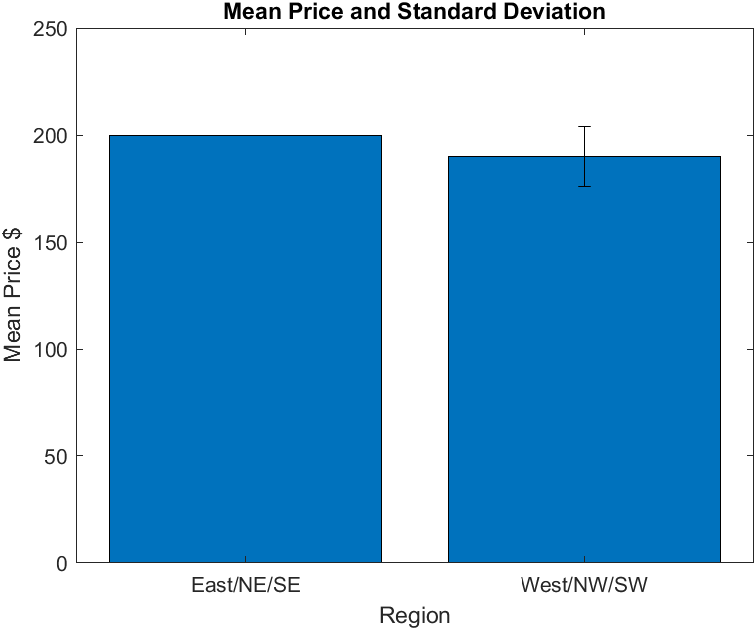
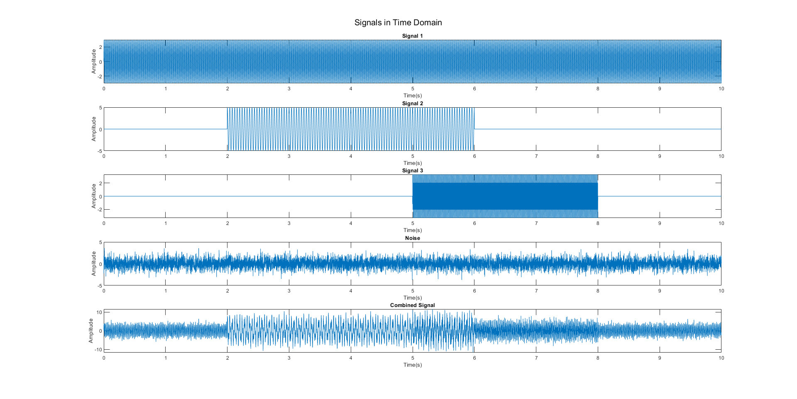
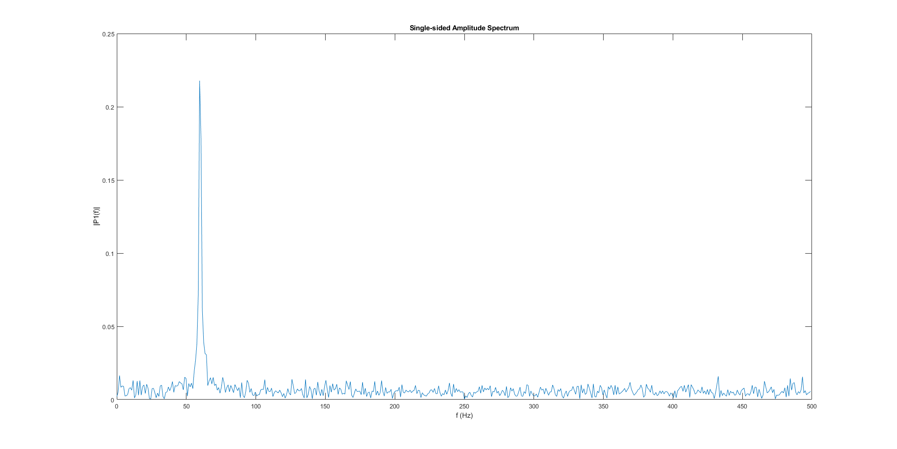
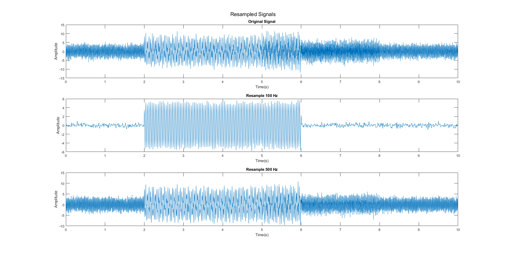
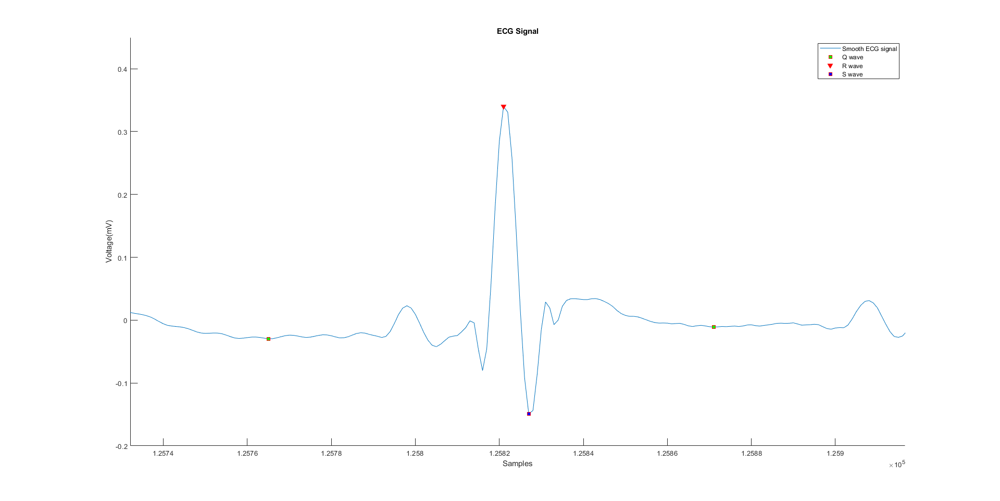
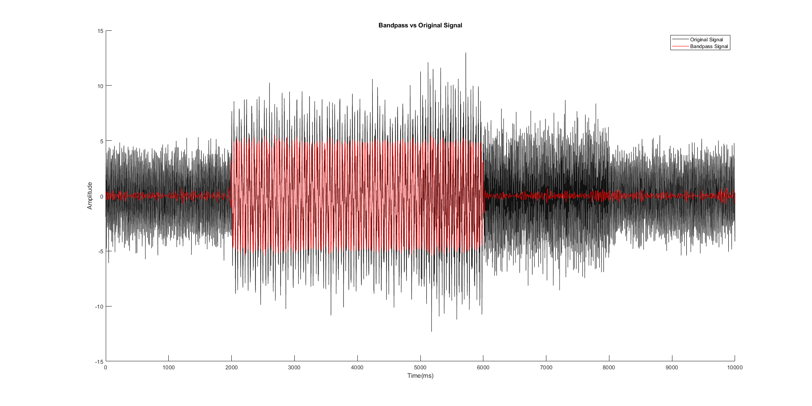
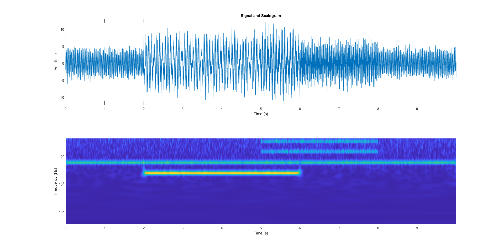
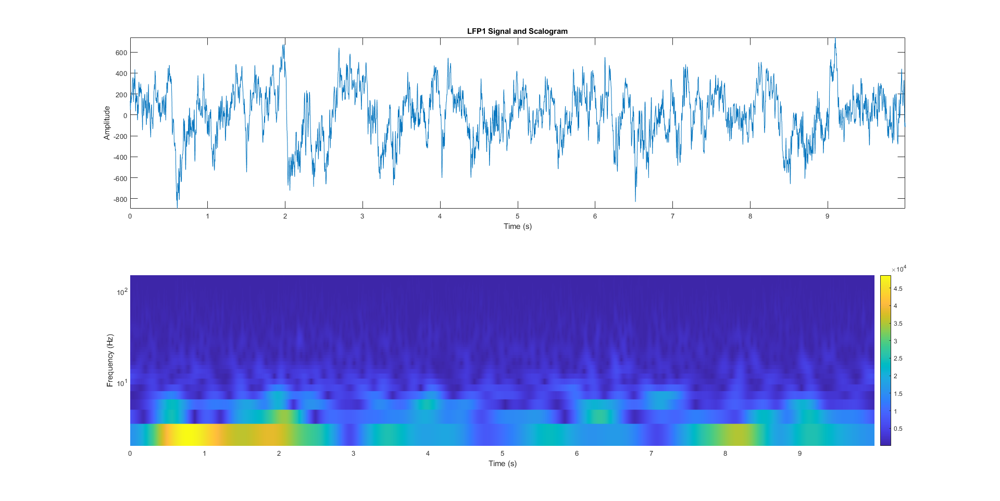

# Data Analytics and Machine Learning

This project has been done to satisfy the Bioelectronic Data Analytics and 
Machine Learning module for Special Topics Course : Bioengineering at New
York Tech.

# Matlab Coding Basics 

## Data Extraction

Extracting complete rows from tabular data using keyword search in columns

```
%Bikes Data Extraction
Bikes = {};

n = 1;

% Iterate through Cell Array to Extract Bike Data
for c = 1:row
    if strcmp(example{c,3},'Bike')
        Bikes(n,:) = example(c,:);
        n=n+1;
    end
end

[row, column] = size(Bikes);
```
## Alphabetic Sort
```
sortrows
```

## Mean and Standard Deviation


# Signal Processing

## Signal Generation


## Power Spectrum

```
% Compute the Fourier transform of the signals.
Y = fft(Signal,n);

% Calculate the double-sided spectrum
P2 = abs(Y/L);

% Calculate the single-sided spectrum
P1 = P2(:,1:n/2+1);
P1(:,2:end-1) = 2*P1(:,2:end-1);
```


## Resampling


# ECG Signal Processing

## Filtering
```
smoothECG = sgolayfilt(ecgsignal,7,21);
```

## QRS Detection
```
[~,locs_Rwave] = findpeaks(smoothECG,'MinPeakHeight',0.2,'MinPeakDistance',100);
[~,locs_Swave] = findpeaks(-smoothECG,'MinPeakHeight',0.08,'MinPeakDistance',100);
[~,locs_Qwave] = findpeaks(-smoothECG,'MinPeakDistance',40);
locs_Qwave = locs_Qwave(smoothECG(locs_Qwave)>-0.066 & smoothECG(locs_Qwave)<1);
```


# Wavelet Analysis

## Bandpass Filter


## Wavelet
```
[cfs,frq] = cwt(Signal,Fs);
tms = (0:numel(Signal)-1)/Fs;
```

### Scalogram Plot for Wavelet Analysis


### Morlet Wavelet Analysis for Local Field Potential


